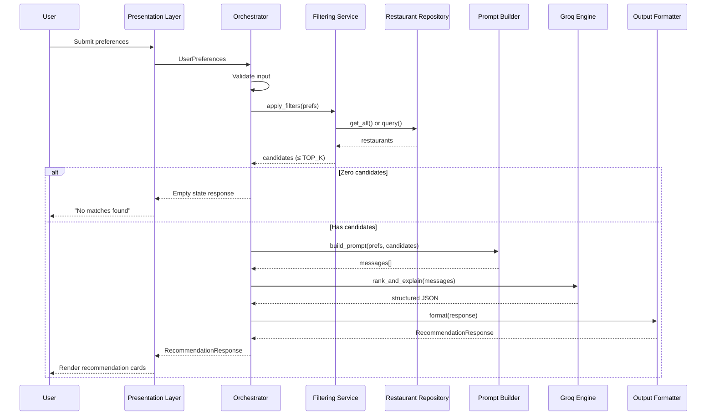
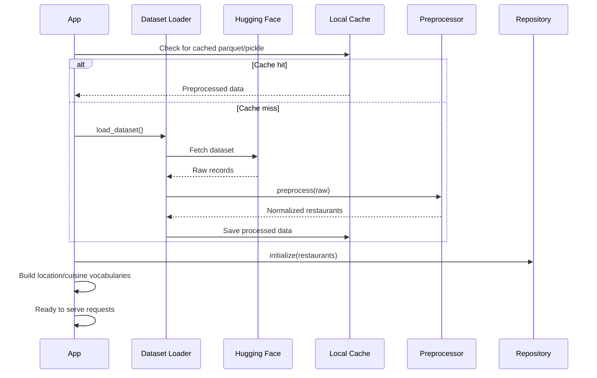

# Architecture: AI-Powered Restaurant Recommendation System

> Derived from [context.md](context.md) · Zomato-inspired hybrid recommendation service

---

## Table of Contents

1. [Executive Summary](#1-executive-summary)
2. [Architectural Goals & Principles](#2-architectural-goals--principles)
3. [High-Level System Architecture](#3-high-level-system-architecture)
4. [Component Design](#4-component-design)
5. [Data Architecture](#5-data-architecture)
6. [Request Lifecycle & Sequence Flows](#6-request-lifecycle--sequence-flows)
7. [Integration Layer & Filtering Strategy](#7-integration-layer--filtering-strategy)
8. [LLM Recommendation Engine](#8-llm-recommendation-engine)
9. [Presentation Layer](#9-presentation-layer)
10. [Suggested Technology Stack](#10-suggested-technology-stack)
11. [Proposed Project Structure](#11-proposed-project-structure)
12. [API Contract (Optional Backend)](#12-api-contract-optional-backend)
13. [Error Handling & Resilience](#13-error-handling--resilience)
14. [Security & Privacy](#14-security--privacy)
15. [Performance & Scalability](#15-performance--scalability)
16. [Testing Strategy](#16-testing-strategy)
17. [Deployment Topology](#17-deployment-topology)
18. [Future Extensions](#18-future-extensions)

---

## 1. Executive Summary

This system recommends restaurants by combining **deterministic structured filtering** over a real Zomato dataset with **LLM-powered ranking and explanation** via **[Groq](https://groq.com/)**. Users submit preferences (location, budget, cuisine, minimum rating, and free-text extras); the application narrows thousands of records to a manageable candidate set, then asks a Groq-hosted model to rank and justify the top choices in natural language.

The architecture is intentionally **modular and pipeline-oriented**: each stage has a single responsibility, clear inputs/outputs, and can be tested independently. Groq's high-throughput inference keeps LLM latency low, while pre-filtering bounds token usage and cost.

---

## 2. Architectural Goals & Principles

| Goal | How the architecture supports it |
|------|----------------------------------|
| **Accuracy** | Hard filters enforce non-negotiable constraints (location, min rating, budget band) before LLM reasoning |
| **Explainability** | LLM generates per-restaurant rationale tied to explicit user preferences |
| **Cost control** | Pre-filtering limits prompt size; only top-N candidates reach the LLM |
| **Maintainability** | Separation of data ingestion, filtering, prompting, and UI layers |
| **Extensibility** | Groq adapter is swappable behind an interface; add vector search or user history without rewriting core filters |
| **User experience** | Structured output rendered as cards/lists—not raw model text or JSON dumps |

**Design principles:**

- **Filter first, reason second** — Never send the full dataset to the LLM.
- **Structured in, structured out** — Prompts and LLM responses use schemas (JSON) for reliable parsing.
- **Fail gracefully** — If the Groq API is unavailable, fall back to rule-based ranking of filtered results.
- **Cache aggressively** — Dataset and location/cuisine vocabularies are loaded once at startup.

---

## 3. High-Level System Architecture

```
┌─────────────────────────────────────────────────────────────────────────────┐
│                           PRESENTATION LAYER                                │
│  ┌─────────────────┐   ┌─────────────────┐   ┌─────────────────────────┐   │
│  │ Preference Form │   │ Results View    │   │ Loading / Error States  │   │
│  └────────┬────────┘   └────────▲────────┘   └─────────────────────────┘   │
└───────────┼─────────────────────┼───────────────────────────────────────────┘
            │ UserPreferences       │ RecommendationResponse
            ▼                       │
┌─────────────────────────────────────────────────────────────────────────────┐
│                           APPLICATION LAYER                                 │
│  ┌──────────────────────────────────────────────────────────────────────┐  │
│  │                    Recommendation Orchestrator                        │  │
│  │  validate → filter → build prompt → call LLM → parse → format output │  │
│  └──────────────────────────────────────────────────────────────────────┘  │
└───────────┬───────────────────────────────┬─────────────────────────────────┘
            │                               │
            ▼                               ▼
┌───────────────────────┐       ┌─────────────────────────────────────────────┐
│   FILTERING SERVICE   │       │         LLM RECOMMENDATION SERVICE          │
│  - Location match     │       │  - Prompt template engine                   │
│  - Budget band        │       │  - Groq provider adapter                    │
│  - Cuisine match      │       │  - Response schema validation               │
│  - Min rating         │       │  - Fallback ranker                          │
│  - Keyword extras     │       └─────────────────────────────────────────────┘
└───────────┬───────────┘
            │
            ▼
┌─────────────────────────────────────────────────────────────────────────────┐
│                              DATA LAYER                                     │
│  ┌─────────────────┐   ┌─────────────────┐   ┌─────────────────────────┐   │
│  │ Dataset Loader  │──▶│ Preprocessor    │──▶│ In-Memory Restaurant    │   │
│  │ (Hugging Face)  │   │ & Normalizer    │   │ Repository / DataFrame  │   │
│  └─────────────────┘   └─────────────────┘   └─────────────────────────┘   │
└─────────────────────────────────────────────────────────────────────────────┘
            ▲
            │
┌───────────┴───────────┐
│  Hugging Face Dataset │
│  ManikaSaini/zomato-  │
│  restaurant-rec...    │
└───────────────────────┘
```

---

## 4. Component Design

### 4.1 Data Ingestion Module

**Responsibility:** Load, clean, normalize, and persist restaurant records in an application-ready format.

| Sub-component | Description |
|---------------|-------------|
| `DatasetLoader` | Fetches dataset from Hugging Face (`datasets` library or HTTP) |
| `FieldExtractor` | Maps raw columns to canonical schema (name, location, cuisine, cost, rating) |
| `Normalizer` | Standardizes location names, cuisine strings, cost ranges, and rating scales |
| `RestaurantRepository` | Provides query interface over in-memory store (DataFrame, list of dataclasses, or SQLite) |

**Startup behavior:**

1. Download or load cached dataset on first run.
2. Run preprocessing pipeline once.
3. Build lookup indexes (locations, cuisines) for form autocomplete.
4. Expose read-only repository to the application layer.

**Output:** `List[Restaurant]` — normalized, indexed, ready for filtering.

---

### 4.2 User Input Module

**Responsibility:** Collect, validate, and normalize user preferences.

**Input schema (`UserPreferences`):**

```python
UserPreferences = {
    "location": str,           # e.g. "Indiranagar", "Whitefield"
    "budget": Literal["low", "medium", "high"],
    "cuisine": str | None,     # e.g. "Italian", "Chinese"
    "min_rating": float,       # e.g. 4.0
    "additional_preferences": str | None  # free text: "family-friendly, quick service"
}
```

**Validation rules:**

| Field | Validation |
|-------|------------|
| `location` | Required; fuzzy-matched against known locations from dataset |
| `budget` | Required; enum only |
| `cuisine` | Optional; fuzzy-matched against known cuisines |
| `min_rating` | Optional; clamped to dataset rating range (e.g. 0–5) |
| `additional_preferences` | Optional; max length cap (e.g. 500 chars) |

**UI responsibilities:**

- Dropdown/autocomplete for location and cuisine (populated from dataset vocabularies).
- Radio buttons or select for budget tier.
- Slider or numeric input for minimum rating.
- Text area for additional preferences.

---

### 4.3 Filtering Service (Integration Layer — Part 1)

**Responsibility:** Deterministically narrow the restaurant corpus to a candidate set aligned with hard constraints.

**Filter pipeline (applied in order):**

```
All Restaurants
    → Location Filter      (exact or fuzzy match on area/locality)
    → Rating Filter        (rating >= min_rating)
    → Cuisine Filter       (contains or equals requested cuisine)
    → Budget Filter        (cost band maps to low/medium/high)
    → Keyword Filter       (optional: match additional_preferences against tags/description)
    → Cap to TOP_K         (e.g. 20–30 candidates max for LLM context)
```

**Budget band mapping (configurable):**

| Tier | Typical cost range (example) |
|------|------------------------------|
| Low | ≤ ₹300 for two |
| Medium | ₹300 – ₹800 |
| High | > ₹800 |

> Exact thresholds should be derived from dataset cost distribution during preprocessing.

**Output:** `List[RestaurantCandidate]` — filtered records with metadata preserved for prompting.

---

### 4.4 Prompt Builder (Integration Layer — Part 2)

**Responsibility:** Serialize user preferences and candidate restaurants into a structured LLM prompt.

**Prompt structure:**

1. **System message** — Role, constraints, output JSON schema, ranking criteria.
2. **User message** — User preferences + compact restaurant table (JSON array or markdown table).

**Design constraints:**

- Include only fields needed for ranking (name, cuisine, rating, cost, location, optional tags).
- Instruct model to return **exactly** `top_n` recommendations (e.g. 5).
- Require JSON output for reliable parsing.
- Explicitly tie explanations to user-stated preferences.

---

### 4.5 LLM Recommendation Engine (Groq)

**Responsibility:** Rank candidates, generate explanations, and optionally summarize the result set using the **Groq Inference API**.

**Core operations:**

| Operation | Input | Output |
|-----------|-------|--------|
| `rank_and_explain` | UserPreferences + candidates | Ranked list with explanations |
| `summarize` (optional) | Ranked list + preferences | Short paragraph overview |

**Groq integration:**

| Property | Value |
|----------|-------|
| **Provider** | [Groq](https://console.groq.com/) |
| **Python SDK** | `groq` |
| **API compatibility** | OpenAI-compatible chat completions (`client.chat.completions.create`) |
| **Authentication** | `GROQ_API_KEY` environment variable |
| **Default model** | `llama-3.3-70b-versatile` |

**Provider abstraction:**

```
LLMProvider (interface)
    └── GroqProvider          # primary — used in this project
        ├── model: llama-3.3-70b-versatile   (default, best quality)
        ├── model: llama-3.1-8b-instant      (fastest, lower cost)
        └── model: mixtral-8x7b-32768        (alternative)
```

The `GroqProvider` wraps the official `groq` SDK, sends structured prompts built by the integration layer, and parses JSON responses into `Recommendation` objects.

**Fallback path:** If the Groq API call fails or returns invalid JSON, apply deterministic scoring:

```
score = (rating × 0.5) + (budget_match × 0.3) + (cuisine_match × 0.2)
```

Return top-N with generic template explanations.

---

### 4.6 Output Formatter & Presentation Layer

**Responsibility:** Transform engine output into UI-ready recommendation cards.

**Output schema (`Recommendation`):**

```python
Recommendation = {
    "rank": int,
    "restaurant_name": str,
    "cuisine": str,
    "rating": float,
    "estimated_cost": str,       # human-readable, e.g. "₹500 for two"
    "location": str,
    "explanation": str,          # AI-generated rationale
}
```

**Response wrapper (`RecommendationResponse`):**

```python
RecommendationResponse = {
    "recommendations": List[Recommendation],
    "summary": str | None,       # optional LLM overview
    "total_candidates_considered": int,
    "filters_applied": dict,
}
```

**UI rendering:**

- Card layout per recommendation (name, cuisine, rating stars, cost badge, explanation).
- Optional summary banner at top.
- Empty state when filters yield zero candidates.
- Loading spinner during LLM call.

---

## 5. Data Architecture

### 5.1 Source Dataset

| Property | Value |
|----------|-------|
| Provider | Hugging Face |
| Dataset ID | `ManikaSaini/zomato-restaurant-recommendation` |
| URL | https://huggingface.co/datasets/ManikaSaini/zomato-restaurant-recommendation |

### 5.2 Canonical Restaurant Model

After preprocessing, each record conforms to:

```python
Restaurant = {
    "id": str,                    # stable identifier (generated if absent)
    "name": str,
    "location": str,              # normalized locality/area
    "city": str | None,
    "cuisine": str,               # primary or comma-separated cuisines
    "rating": float,              # normalized 0–5
    "cost_for_two": int | None,   # numeric INR if parseable
    "budget_tier": str,           # derived: low | medium | high
    "address": str | None,
    "tags": List[str] | None,     # e.g. ["family-friendly", "quick bites"]
    "raw": dict | None,           # optional: preserve original row for debugging
}
```

### 5.3 Preprocessing Steps

1. **Null handling** — Drop or impute records missing name, location, or rating.
2. **Location normalization** — Lowercase, trim, alias map (e.g. "indira nagar" → "Indiranagar").
3. **Cuisine normalization** — Split multi-cuisine strings; title-case; deduplicate.
4. **Cost parsing** — Extract numeric `cost_for_two` from strings like "₹600 for two".
5. **Budget tier assignment** — Quantile-based or fixed-threshold mapping from cost distribution.
6. **Rating normalization** — Ensure consistent float scale.
7. **Index building** — Unique sorted lists of locations and cuisines for UI and validation.

### 5.4 Storage Strategy

| Phase | Storage | Rationale |
|-------|---------|-----------|
| MVP / prototype | In-memory pandas DataFrame or list of dataclasses | Simple, fast for single-process apps |
| Cached persistence | Parquet or pickle on disk | Avoid re-downloading and re-processing on every startup |
| Future scale | SQLite or PostgreSQL | Supports concurrent reads, richer queries |

---

## 6. Request Lifecycle & Sequence Flows

### 6.1 End-to-End Recommendation Flow



### 6.2 Application Startup Flow



---

## 7. Integration Layer & Filtering Strategy

The integration layer bridges **structured data** and **LLM reasoning**. It has two phases: **deterministic filtering** and **prompt construction**.

### 7.1 Filter Logic Detail

| Filter | Match strategy | Notes |
|--------|---------------|-------|
| Location | Case-insensitive substring or fuzzy (Levenshtein / rapidfuzz) | Handle variants: "Whitefield" vs "white field" |
| Min rating | `restaurant.rating >= prefs.min_rating` | Hard constraint |
| Cuisine | Token match in cuisine field | "Italian" matches "Italian, Pizza" |
| Budget | `restaurant.budget_tier == prefs.budget` | Derived during preprocessing |
| Additional prefs | Keyword scan against tags, name, cuisine | Soft filter; used for LLM context even if no tag match |

### 7.2 Candidate Cap (`TOP_K`)

After filtering, cap results before sending to the LLM:

- **Default:** 25 candidates
- **Pre-rank heuristic (optional):** Sort by rating descending, then trim
- **Rationale:** Controls token usage and latency while preserving quality

### 7.3 Prompt Template (Conceptual)

**System prompt (excerpt):**

```
You are a restaurant recommendation assistant for Bangalore (Zomato-style).
Given user preferences and a list of candidate restaurants, rank the top {top_n}
options and explain why each fits the user's needs.

Rules:
- Only recommend from the provided candidate list.
- Reference specific user preferences in each explanation.
- Return valid JSON matching the schema below.
- Do not invent restaurants or attributes not in the data.
```

**Expected JSON schema:**

```json
{
  "recommendations": [
    {
      "restaurant_name": "string",
      "rank": 1,
      "explanation": "string"
    }
  ],
  "summary": "string (optional)"
}
```

Post-processing merges LLM ranks/explanations with canonical fields (rating, cost, cuisine) from the candidate records.

---

## 8. LLM Recommendation Engine (Groq)

All LLM inference in this project runs through **Groq**. The application does not call OpenAI, Anthropic, or local model servers directly.

### 8.1 Groq Configuration

**SDK usage (conceptual):**

```python
from groq import Groq

client = Groq(api_key=settings.GROQ_API_KEY)

response = client.chat.completions.create(
    model=settings.GROQ_MODEL,          # e.g. "llama-3.3-70b-versatile"
    messages=[
        {"role": "system", "content": system_prompt},
        {"role": "user", "content": user_prompt},
    ],
    temperature=0.3,
    response_format={"type": "json_object"},  # when supported by model
)
```

**Recommended models:**

| Model | Use case | Notes |
|-------|----------|-------|
| `llama-3.3-70b-versatile` | **Default** — ranking + explanations | Best balance of quality and reasoning |
| `llama-3.1-8b-instant` | Fast demos, high throughput | Lowest latency; simpler explanations |
| `mixtral-8x7b-32768` | Long prompts / many candidates | Larger context window |

Model availability may change; verify current options at [Groq Console → Models](https://console.groq.com/docs/models).

### 8.2 Ranking Criteria (Instructed to Model)

The LLM should weigh recommendations using this priority:

1. **Hard fit** — Matches location, meets minimum rating, aligns with budget tier.
2. **Cuisine alignment** — Exact or partial cuisine match.
3. **Soft preferences** — Family-friendly, quick service, ambiance keywords from free text.
4. **Quality signal** — Higher-rated restaurants preferred when other factors are equal.
5. **Value** — Appropriate cost for stated budget tier.

### 8.3 Token & Cost Management

| Technique | Benefit |
|-----------|---------|
| Pre-filter to TOP_K | Reduces input tokens by 90%+ vs full dataset |
| Compact JSON candidate format | Smaller prompts than verbose prose |
| Fixed `top_n` output (e.g. 5) | Bounded output tokens |
| Response schema enforcement | Avoids re-prompting for malformed output |
| Optional streaming | Groq supports streaming; improves perceived latency in UI |
| Groq free tier | Generous rate limits for hackathon/MVP workloads |

### 8.4 Groq-Specific Considerations

| Topic | Guidance |
|-------|----------|
| **Rate limits** | Groq enforces requests-per-minute and tokens-per-minute per model; handle `429` with exponential backoff |
| **JSON output** | Prefer `response_format={"type": "json_object"}`; validate with Pydantic after parse |
| **Temperature** | Use `0.2–0.4` for consistent ranking; higher values add variability to explanations |
| **Timeouts** | Set client timeout (e.g. 30s); Groq is typically much faster than other cloud LLM APIs |
| **Secrets** | Obtain API key from [console.groq.com](https://console.groq.com/); store as `GROQ_API_KEY` only |

### 8.5 Fallback Ranker

When the Groq API is unavailable:

```
deterministic_score(restaurant, prefs) =
    rating_weight       × normalize(rating)
  + budget_weight       × (1 if budget_tier matches else 0)
  + cuisine_weight      × (1 if cuisine matches else 0)
  + keyword_weight      × keyword_overlap(tags, additional_preferences)
```

Return top-N with template explanation: *"Rated {rating}/5, serves {cuisine}, fits your {budget} budget in {location}."*

---

## 9. Presentation Layer

### 9.1 Recommended UI Architecture

Two viable deployment patterns:

| Pattern | Description | Best for |
|---------|-------------|----------|
| **Monolithic Streamlit/Gradio** | Single Python app: form + orchestrator + display | Hackathons, MVPs, demos |
| **SPA + REST API** | React/Vue frontend + FastAPI backend | Production, mobile clients |

### 9.2 Key UI States

| State | Behavior |
|-------|----------|
| **Initial** | Empty form with autocomplete for location/cuisine |
| **Loading** | Skeleton cards or spinner after submit |
| **Success** | Recommendation cards + optional summary |
| **Empty results** | Suggest relaxing filters (lower rating, different location) |
| **Error** | Friendly message; show fallback results if available |

### 9.3 Recommendation Card Layout

```
┌─────────────────────────────────────────────┐
│  #1  Restaurant Name              ★ 4.5   │
│      Italian · Indiranagar · ₹600 for two   │
│                                             │
│  "Great fit for your medium budget and      │
│   Italian craving — highly rated and        │
│   known for quick service."                 │
└─────────────────────────────────────────────┘
```

---

## 10. Suggested Technology Stack

| Layer | Recommended | Alternatives |
|-------|-------------|--------------|
| Language | Python 3.11+ | — |
| Dataset loading | `datasets` (Hugging Face) | Direct CSV download |
| Data processing | `pandas` | Polars |
| Fuzzy matching | `rapidfuzz` | `fuzzywuzzy` |
| LLM provider | **Groq** (`groq` SDK) | — |
| Validation | `pydantic` v2 | dataclasses + manual checks |
| API (optional) | FastAPI + Uvicorn | Flask |
| Frontend (MVP) | Streamlit | Gradio |
| Frontend (prod) | React + Tailwind | Next.js |
| Config | `.env` + `pydantic-settings` | python-dotenv |
| Testing | `pytest` | unittest |
| Caching | Local Parquet file | Redis (future) |

---

## 11. Proposed Project Structure

```
restaurant-recommender/
├── app/
│   ├── __init__.py
│   ├── main.py                  # Entry point (Streamlit or FastAPI)
│   ├── config.py                # Settings, env vars, constants
│   │
│   ├── data/
│   │   ├── loader.py            # Hugging Face dataset fetch
│   │   ├── preprocessor.py      # Normalization pipeline
│   │   └── repository.py        # In-memory query interface
│   │
│   ├── models/
│   │   ├── restaurant.py        # Restaurant dataclass / Pydantic model
│   │   ├── preferences.py       # UserPreferences schema
│   │   └── recommendation.py    # Recommendation response schema
│   │
│   ├── services/
│   │   ├── filter_service.py    # Deterministic filtering
│   │   ├── prompt_builder.py    # LLM prompt templates
│   │   ├── groq_service.py      # Groq client wrapper + fallback ranker
│   │   └── orchestrator.py      # End-to-end pipeline coordinator
│   │
│   └── ui/
│       ├── components.py        # Reusable form/result widgets (Streamlit)
│       └── pages.py             # Page layout (if multi-page)
│
├── data/
│   └── cache/                   # Processed dataset cache (gitignored)
│
├── tests/
│   ├── test_preprocessor.py
│   ├── test_filter_service.py
│   ├── test_prompt_builder.py
│   ├── test_groq_service.py
│   └── test_orchestrator.py
├── .env.example                 # GROQ_API_KEY template
├── requirements.txt
├── context.md
├── architecture.md
└── README.md
```

---

## 12. API Contract (Optional Backend)

If exposing a REST API (e.g. FastAPI), the following contract supports decoupled frontends.

### `POST /api/v1/recommendations`

**Request:**

```json
{
  "location": "Indiranagar",
  "budget": "medium",
  "cuisine": "Italian",
  "min_rating": 4.0,
  "additional_preferences": "family-friendly, quick service",
  "top_n": 5
}
```

**Response (200):**

```json
{
  "recommendations": [
    {
      "rank": 1,
      "restaurant_name": "Example Bistro",
      "cuisine": "Italian",
      "rating": 4.5,
      "estimated_cost": "₹600 for two",
      "location": "Indiranagar",
      "explanation": "Highly rated Italian spot in Indiranagar that fits your medium budget..."
    }
  ],
  "summary": "Based on your preferences, here are five Italian restaurants in Indiranagar...",
  "total_candidates_considered": 18,
  "filters_applied": {
    "location": "Indiranagar",
    "budget": "medium",
    "cuisine": "Italian",
    "min_rating": 4.0
  }
}
```

**Error responses:**

| Status | Condition |
|--------|-----------|
| `400` | Invalid or missing required fields |
| `422` | Validation failure (unknown location, invalid budget enum) |
| `502` | Groq API error (include fallback results if partial success) |
| `503` | Dataset not loaded |

### `GET /api/v1/metadata`

Returns vocabularies for UI autocomplete:

```json
{
  "locations": ["Indiranagar", "Whitefield", "Church Street", "..."],
  "cuisines": ["Italian", "Chinese", "North Indian", "..."],
  "budget_tiers": ["low", "medium", "high"],
  "rating_range": { "min": 0, "max": 5 }
}
```

---

## 13. Error Handling & Resilience

| Failure | Detection | Recovery |
|---------|-----------|----------|
| Dataset download fails | Network/HTTP error on startup | Retry with backoff; use local cache if exists |
| Zero filter matches | Empty candidate list | Return empty state with filter relaxation suggestions |
| Groq timeout | Request exceeds threshold (e.g. 30s) | Retry once; then fallback ranker |
| Invalid Groq JSON | Schema validation fails | Retry with stricter prompt; then fallback ranker |
| Unknown location | Fuzzy match below threshold | Suggest closest locations from vocabulary |
| Groq rate limit | `429` from Groq API | Exponential backoff; optionally switch to `llama-3.1-8b-instant`; return fallback |

**Logging:** Log filter counts, prompt token estimates, LLM latency, and fallback activation for observability.

---

## 14. Security & Privacy

| Concern | Mitigation |
|---------|------------|
| API key exposure | Store `GROQ_API_KEY` in `.env`; never commit secrets; Groq calls are server-side only |
| Prompt injection | Sanitize `additional_preferences`; instruct model to ignore override attempts |
| Data leakage | Do not send full dataset or PII to LLM—only filtered candidates |
| Input abuse | Rate limit API endpoints; cap free-text length |
| Dependency risk | Pin versions in `requirements.txt`; audit Hugging Face dataset source |

No user accounts or persistent personal data are required for the MVP—preferences are ephemeral per request.

---

## 15. Performance & Scalability

### 15.1 Expected Latencies (MVP)

| Stage | Typical duration |
|-------|-----------------|
| In-memory filter | < 50 ms |
| Prompt build | < 10 ms |
| Groq LLM call | 0.5–3 s (Groq LPU inference; model-dependent) |
| Render UI | < 100 ms |

### 15.2 Optimization Levers

- **Startup cache** — Preprocessed Parquet avoids repeated Hugging Face downloads.
- **TOP_K cap** — Primary lever for LLM cost and latency.
- **Async Groq calls** — Non-blocking API handlers (FastAPI `async` + `groq` async client).
- **Horizontal scale (future)** — Stateless API behind load balancer; shared Redis cache for dataset metadata.

---

## 16. Testing Strategy

| Test type | Scope | Examples |
|-----------|-------|----------|
| **Unit** | Preprocessor, filters, prompt builder | Location normalization; budget tier assignment; filter combinations |
| **Integration** | Orchestrator with mocked Groq | End-to-end pipeline returns valid `RecommendationResponse` |
| **Contract** | Groq response parsing | Malformed JSON triggers fallback |
| **Snapshot** | Prompt templates | Prompt structure stable across refactors |
| **Manual / E2E** | UI flows | Submit form → see cards; empty state; error state |

**Mocking:** Replace `GroqProvider` with a fixture returning deterministic JSON for CI pipelines (no live Groq API calls in unit tests).

---

## 17. Deployment Topology

### MVP (Single Machine)

```
User Browser → Streamlit App (localhost:8501)
                    ├── In-memory Repository
                    └── Groq API (api.groq.com)
```

### Production (Decoupled)

```
User Browser → CDN / Static Frontend
                    ↓
              Load Balancer
                    ↓
              FastAPI (N replicas)
                    ├── Cached Restaurant Data
                    └── Groq API (api.groq.com)
```

**Environment variables:**

```
HF_DATASET_ID=ManikaSaini/zomato-restaurant-recommendation
GROQ_API_KEY=gsk_...
GROQ_MODEL=llama-3.3-70b-versatile
TOP_K_CANDIDATES=25
TOP_N_RECOMMENDATIONS=5
CACHE_DIR=./data/cache
```

---

## 18. Future Extensions

| Extension | Architectural impact |
|-----------|------------------------|
| **User history & personalization** | Add user profile store; inject past favorites into prompt |
| **Semantic search** | Embed restaurant descriptions; vector DB retrieval before LLM |
| **Multi-city support** | Extend location hierarchy (city → locality); city-aware filters |
| **Real-time Zomato API** | Replace static dataset with live API adapter implementing same `RestaurantRepository` interface |
| **Feedback loop** | Log thumbs-up/down; fine-tune ranking weights or prompts |
| **Maps integration** | Enrich output with coordinates and map pins |
| **Multi-language** | Localize UI and LLM prompts |

---

## Appendix: Requirements Traceability

| Context requirement | Architecture section |
|---------------------|---------------------|
| Load Zomato dataset from Hugging Face | §4.1, §5.1, §6.2 |
| Preprocess and extract fields | §5.2, §5.3 |
| Accept user preferences | §4.2 |
| Filter dataset based on input | §4.3, §7.1 |
| Build LLM prompt with structured data | §4.4, §7.3 |
| LLM ranks and explains (via Groq) | §4.5, §8 |
| Display name, cuisine, rating, cost, explanation | §4.6, §9.3 |
| Hybrid filter + LLM approach | §2, §7 |
| Readable UX (not raw dumps) | §4.6, §9 |
