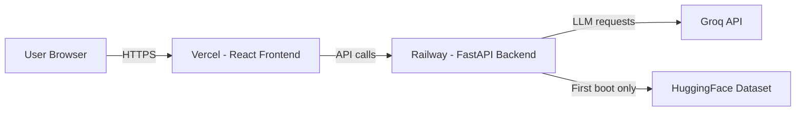

# Deployment Plan — Zomato AI Matchmaker

> **Backend** → [Railway](https://railway.app)  
> **Frontend** → [Vercel](https://vercel.com)  
> **Repo** → [github.com/tkvp023/Zomato-AI-matchmaker-build-hours-](https://github.com/tkvp023/Zomato-AI-matchmaker-build-hours-)

---

## Architecture Overview



| Component | Stack | Deploy Target | URL Pattern |
|-----------|-------|--------------|-------------|
| Frontend | React + Vite | Vercel | `https://zomato-ai-matchmaker.vercel.app` |
| Backend | FastAPI + Uvicorn | Railway | `https://zomato-ai-matchmaker-*.up.railway.app` |

---

## Pre-Deployment Checklist

- [ ] Code pushed to GitHub ✅ (already done)
- [ ] `.env` is gitignored ✅
- [ ] `data/cache/restaurants.parquet` is committed (0.87 MB — fits within git)
- [ ] CORS origins updated for production URLs
- [ ] Frontend API URL configurable via env var (`VITE_API_URL`)

---

## Step 1 — Deploy Backend on Railway

### 1.1 Create Required Files

Before deploying, create these two files in the **project root**:

#### `Procfile`
```
web: uvicorn app.api.main:app --host 0.0.0.0 --port $PORT
```

#### `runtime.txt`
```
python-3.12.x
```

#### `nixpacks.toml` (recommended — explicit build config)
```toml
[phases.setup]
nixPkgs = ["python312"]

[phases.install]
cmds = ["pip install -r requirements.txt"]

[start]
cmd = "uvicorn app.api.main:app --host 0.0.0.0 --port ${PORT:-8000}"
```

> [!NOTE]
> Railway auto-detects Python projects, but `nixpacks.toml` gives you explicit control over the build process.

### 1.2 Update CORS for Production

In [`app/api/main.py`](file:///c:/Users/THARUN/Music/Build%20hours/app/api/main.py), update the CORS origins to include your Vercel domain:

```python
import os

origins = [
    "http://localhost",
    "http://localhost:5173",
    "http://localhost:3000",
    "http://localhost:8000",
    "http://127.0.0.1:5173",
    "http://127.0.0.1:8000",
]

# Add production frontend URL from environment
frontend_url = os.getenv("FRONTEND_URL", "")
if frontend_url:
    origins.append(frontend_url)
```

### 1.3 Deploy on Railway

1. Go to [railway.app](https://railway.app) → **New Project** → **Deploy from GitHub repo**
2. Select the repo: `tkvp023/Zomato-AI-matchmaker-build-hours-`
3. Railway will auto-detect Python and start building

### 1.4 Set Environment Variables on Railway

Go to your service → **Variables** tab → Add:

| Variable | Value | Required |
|----------|-------|----------|
| `GROQ_API_KEY` | `gsk_your_actual_key` | ✅ Yes |
| `GROQ_MODEL` | `llama-3.3-70b-versatile` | Optional (has default) |
| `HF_DATASET_ID` | `ManikaSaini/zomato-restaurant-recommendation` | Optional (has default) |
| `TOP_K_CANDIDATES` | `25` | Optional (has default) |
| `TOP_N_RECOMMENDATIONS` | `5` | Optional (has default) |
| `CACHE_DIR` | `./data/cache` | Optional (has default) |
| `FRONTEND_URL` | `https://your-app.vercel.app` | ✅ Yes (for CORS) |
| `PORT` | Auto-set by Railway | ⚙️ Auto |

> [!IMPORTANT]
> `GROQ_API_KEY` is the only **required** secret. Without it, the recommendation engine falls back to non-AI filtering, which won't produce ranked results.

### 1.5 Configure Networking

1. In the Railway service → **Settings** → **Networking**
2. Click **Generate Domain** to get a public URL like `zomato-ai-matchmaker-production.up.railway.app`
3. Note this URL — you'll need it for the frontend

### 1.6 Verify Backend

```bash
curl https://your-railway-url.up.railway.app/api/v1/metadata
```

Expected response:
```json
{
  "locations": ["Banashankari", "Bellandur", ...],
  "cuisines": ["Arabian", "Chinese", ...],
  "groq_available": true
}
```

---

## Step 2 — Deploy Frontend on Vercel

### 2.1 Vercel Project Setup

1. Go to [vercel.com](https://vercel.com) → **Add New Project** → **Import Git Repository**
2. Select the repo: `tkvp023/Zomato-AI-matchmaker-build-hours-`
3. **Configure the project:**

| Setting | Value |
|---------|-------|
| **Framework Preset** | Vite |
| **Root Directory** | `frontend` |
| **Build Command** | `npm run build` (auto-detected) |
| **Output Directory** | `dist` (auto-detected) |
| **Install Command** | `npm install` (auto-detected) |

> [!IMPORTANT]
> You **must** set the **Root Directory** to `frontend` since the frontend lives in a subdirectory of the monorepo.

### 2.2 Set Environment Variables on Vercel

Go to **Settings** → **Environment Variables** → Add:

| Variable | Value | Environment |
|----------|-------|-------------|
| `VITE_API_URL` | `https://your-railway-url.up.railway.app/api/v1` | Production |

> [!WARNING]
> Vite environment variables **must** be prefixed with `VITE_` to be exposed to the client bundle. The app already uses `VITE_API_URL` in [`client.js`](file:///c:/Users/THARUN/Music/Build%20hours/frontend/src/api/client.js).

### 2.3 Deploy

Click **Deploy**. Vercel will:
1. Install dependencies from `frontend/package.json`
2. Run `npm run build` (Vite production build)
3. Serve the static `dist/` output on their CDN

### 2.4 Verify Frontend

1. Open `https://your-app.vercel.app`
2. The UI should load with locations and cuisines populated from the backend
3. Submit a recommendation request and verify results appear

---

## Step 3 — Connect Frontend ↔ Backend

After both are deployed, you need to link them:

### 3A. Update Railway with Vercel URL
In Railway → **Variables**, set:
```
FRONTEND_URL=https://your-app.vercel.app
```
This allows CORS requests from your frontend.

### 3B. Confirm Vercel has Railway URL
In Vercel → **Settings** → **Environment Variables**, confirm:
```
VITE_API_URL=https://your-railway-url.up.railway.app/api/v1
```

> [!TIP]
> After changing env vars on Vercel, trigger a **Redeploy** (Deployments → three-dot menu → Redeploy) for the changes to take effect since Vite inlines them at build time.

---

## Data Handling Strategy

The `restaurants.parquet` cache (0.87 MB) is committed to the repo. On Railway:

1. **First deploy**: The app finds `data/cache/restaurants.parquet` and loads it directly — no HuggingFace download needed
2. **If cache is missing**: The app auto-downloads from HuggingFace, preprocesses, and saves to the cache directory
3. **Railway's ephemeral filesystem**: Files written at runtime are lost on redeploy, but since the parquet is committed to git, it's always available

> [!NOTE]
> If the dataset ever exceeds git-friendly sizes (~50 MB+), consider using Railway's volume mounts or an external object store (e.g., Cloudflare R2).

---

## Cost Estimates

| Service | Plan | Cost |
|---------|------|------|
| Railway | Hobby | **$5/month** (includes $5 credit, pay-per-use after) |
| Vercel | Hobby (Free) | **$0** (100 GB bandwidth/month) |
| Groq | Free tier | **$0** (rate-limited, sufficient for demo) |
| **Total** | | **~$5/month** |

---

## Post-Deployment Checklist

- [ ] Backend health check passes (`/api/v1/metadata`)
- [ ] Frontend loads and populates dropdowns from API
- [ ] Recommendations return successfully
- [ ] CORS works (no browser console errors)
- [ ] Custom domain (optional): Add in Vercel → Settings → Domains

---

## Troubleshooting

| Symptom | Cause | Fix |
|---------|-------|-----|
| Frontend shows "Failed to fetch metadata" | Wrong `VITE_API_URL` or backend not running | Check Vercel env var, check Railway logs |
| CORS error in browser console | `FRONTEND_URL` not set on Railway | Add your Vercel URL to Railway variables, redeploy |
| Backend crashes on startup | Missing `GROQ_API_KEY` | Add key in Railway variables |
| "429 Too Many Requests" from Groq | Groq free-tier rate limit hit | Wait or upgrade Groq plan |
| Recommendations return empty | Location/cuisine filter too narrow | Try broader search (e.g., "BTM Layout", no cuisine filter) |
| Vercel build fails | Root directory not set to `frontend` | Fix in Vercel project settings |

---

## Files to Create Before Deploying

| File | Location | Purpose |
|------|----------|---------|
| `Procfile` | Project root | Tells Railway how to start the app |
| `runtime.txt` | Project root | Specifies Python version |
| `nixpacks.toml` | Project root | Explicit Railway build config |

> [!TIP]
> These files are only needed for Railway. Vercel reads `package.json` in the `frontend/` directory automatically.
